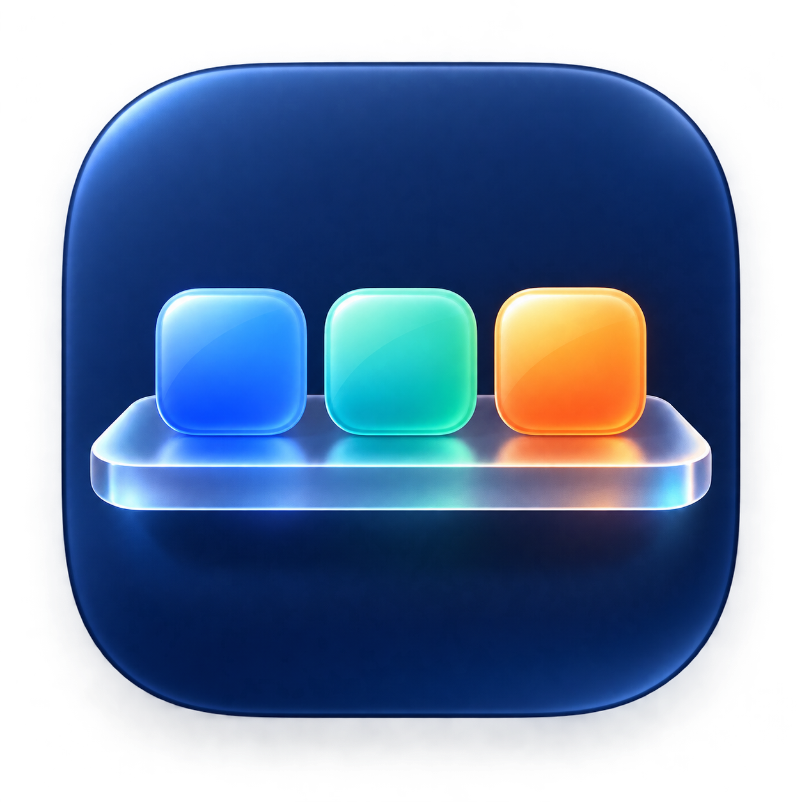

<div align="center">



# BarShelf

**Keep a crowded macOS menu bar under control.**

BarShelf is a native menu bar manager for macOS. It keeps important items visible and puts
everything else one click away.

[Download for macOS](https://github.com/hsurden/barshelf/releases/latest) ·
[Report a problem](https://github.com/hsurden/barshelf/issues) · MIT licensed

</div>

---

## Put every item in one clear section

BarShelf splits the menu bar into two sections.

| Section | What BarShelf does |
|---|---|
| **Visible In the menu bar** |Choose toolbar items that you want to see  |
| **Hidden** | Click the ... to reveal the hidden items.  Click on any one to see it's menu, click on ... again to make it disapepar back into the shelf      |

The default BarShelf icon is a compact ellipsis. You can choose from eight monochrome symbols.

This is inspired by and built upon Barkeep 
https://github.com/iannuttall/barkeep

## Use BarShelf without leaving your current app

- Click the BarShelf icon to open a stable shelf of overflowed and Always hidden items.
- Click the shelf’s gear for **Settings**, followed by **Quit BarShelf**.
- Type while the shelf is open, or Option-click the icon, to open the searchable full picker.


## Your menu bar data stays on your Mac

BarShelf has no account and sends no analytics. It does not use Screen Recording. It stores its
settings, item rules, and profiles in one local JSON file.

```text
~/Library/Application Support/BarShelf/state.json
```

Accessibility access lets BarShelf list, open, and move menu bar items. BarShelf makes a fresh
scan before a move and moves items only after an explicit arrangement or temporary-access action. Launch, wake,
display changes, and timers cannot move an item.

Touch ID or the Mac password can protect the shelf, the picker, and overflow access. Launch at
Login is optional and uses the macOS login item service.

## Install BarShelf

1. Download `BarShelf-<version>.dmg` from the [releases page](https://github.com/hsurden/barshelf/releases/latest).
2. Open the DMG and drag **BarShelf** into the **Applications** folder shown next to it.
3. Open BarShelf from Applications. macOS will refuse the first time, because these builds are not
   notarized by Apple (see below). Open **System Settings > Privacy & Security**, scroll to the
   message about BarShelf, and click **Open Anyway**. This happens once per download.
4. When BarShelf asks, turn it on under **System Settings > Privacy & Security > Accessibility**.
   It needs this to list and move menu bar items. Then click the three dots in the menu bar.

BarShelf supports macOS 14 or later. A local build also needs Xcode 16 or later and XcodeGen.

```sh
brew install xcodegen
make check
make install
```

This personal fork also has a Command-Line-Tools fallback for HS's current Mac, where full Xcode is
not installed:

```sh
make local-build   # Build dist/BarShelf.app without replacing the installed app
make install       # Install the signed build as ~/Applications/BarShelf.app
```

The fallback uses the local `BarShelf Signing` identity when it is available. `make install`
moves the previous installed copy to Trash, installs the newly signed build at the one canonical
path, and opens it. Without that identity, macOS can ask for Accessibility access again.

## Verify a downloaded build

Release DMGs are built on HS's Mac with `make local-dmg` and signed with a personal certificate,
not an Apple Developer ID, and they are not notarized. That is why macOS asks for **Open Anyway**
once. Gatekeeper will report the signature as unverified; this is expected.

```sh
codesign --verify --deep --strict --verbose=2 /Applications/BarShelf.app
```

Each release also includes a SHA-256 checksum for its DMG.

```sh
shasum -a 256 ~/Downloads/BarShelf-*.dmg
```

## Build and test the app

```sh
make check       # Generate the Xcode project and run tests
make build       # Build and sign dist/BarShelf.app
make local-build # Build dist/BarShelf.app with Command Line Tools
make install     # Install to ~/Applications and open the app
make dmg         # Build a drag-install DMG with Xcode and a Developer ID
make local-dmg   # Build a drag-install DMG with Command Line Tools and the local certificate
```

These are the main source areas.

```text
Sources/BarShelf/App/             app lifecycle and coordination
Sources/BarShelf/StatusBar/       status items and visibility boundaries
Sources/BarShelf/Accessibility/   item scanning and confirmed moves
Sources/BarShelf/System/          hotkeys, login, spacing, and update policy
Sources/BarShelf/UI/              settings, search, and permission views
Tests/BarShelfTests/              unit tests for state and core rules
scripts/                         build, install, DMG, and release commands
```

Read [AGENTS.md](AGENTS.md) before changing the app. The supporting docs cover the
[product rules](docs/PRODUCT.md), [architecture](docs/ARCHITECTURE.md),
[clean-room source audit](docs/AUDIT.md), [common problems](docs/TROUBLESHOOTING.md), and
[release process](docs/RELEASING.md).


## License

BarShelf uses the [MIT License](LICENSE).
